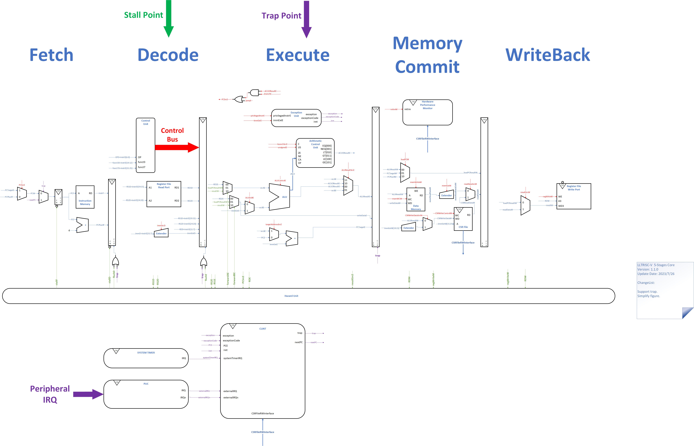
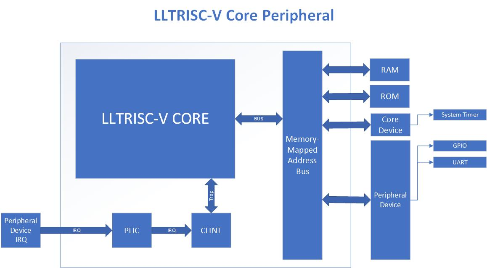
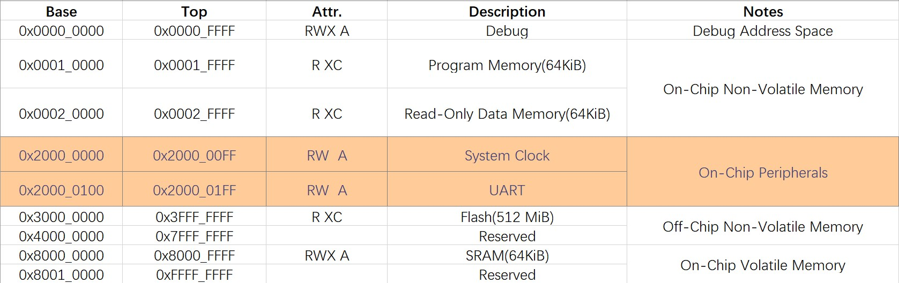

# LLTRISC-V

LoveLonelyTime's RISC-V core.


New!!!: A brand new architecture RISC-V RV32G processor for SuperScalar, Out-Of-Order, dynamic scheduling and freely configured execution core is under development!

[LLTRISC-V-Exq](https://github.com/LoveLonelyTime/LLTRISC-V-Exq)

## Feature

- 5-Stages pipeline.
- RISC-V RV32I_Zicsr M-mode architecture.
- Support operating system.
- Interrupts and memory-mapped I/O system.
- Running on FPGA.

## Architecture

LLTRISC-V is a 5-stage pipeline processor, the following figure shows the five level pipeline architecture.


The five level pipeline includes:

- Fetch: Fetch an instruction from instruction memory.
- Decode: Decode instruction.
- Execute: ALU execution, logical evaluation.
- Memory Commit: Access data memory, commit instruction.
- WriteBack: Write back to register.



The following figure shows the relationship between peripheral devices.

LLTRISC-V use memory-mapped I/O pattern. So most peripherals have their own memory addresses. The program achieves operational I/O by reading and writing peripheral memory.



The following figure is the recommended Memory map:



## Directory Structure

Hardware implementation:

- `/hw` : Hardware implements.
- `/hw/core` : Core components.
- `/hw/core/stages` : Pipeline stages.
- `/hw/soc` : System on chip.

Test:
- `/test` : Hardware DUTs(Devices Under Test).

RISC-V operating system:

- `/os/rt-thread-nano` : [RT-Thread-Nano](https://www.rt-thread.org/document/site/#/rt-thread-version/rt-thread-nano/) on RISC-V.

Board support package(BSP):

- `/os/rt-thread-nano/bsp/testbench` : For Testbench.

- `/os/rt-thread-nano/bsp/tang-nano-9k` : For [Tang Nano 9K](https://wiki.sipeed.com/hardware/zh/tang/Tang-Nano-9K/Nano-9K.html).

Tools:

- `/tools` : Memory image tools, etc.

Tang Nano 9K:

- `/tang9k` : Development environment for Tang Nano 9K.

## Test

You can write testcases through the following steps:

1. Install RISC-V cross-compiler.

To compile the C source(*.c) to RISC-V arch, you must use the RISC-V cross-compiler. Fortunately, riscv-collab is committed to this work.

Follow [riscv-gnu-toolchain](https://github.com/riscv-collab/riscv-gnu-toolchain) to install RISC-V cross-compiler. Use `-with-arch=rv32i` to choose RV32I arch.

```bash
./configure --prefix=/opt/riscv -with-arch=rv32i
make
```

Finally, you should have `riscv32-unknown-elf-gcc` binary.(Put it into your PATH)

2. Install verilator.

> Verilator is invoked with parameters similar to GCC or Synopsys's VCS. It "Verilates" the specified Verilog or SystemVerilog code by reading it, performing lint checks, and optionally inserting assertion checks and coverage-analysis points. It outputs single- or multithreaded .cpp and .h files, the "Verilated" code.

In short, verilator will help you to emulate the verilog code.

Follow [Verilator Install Doc](https://verilator.org/guide/latest/install.html) to install Verilator.

If you get(for example):

```bash
$ verilator --version
Verilator 5.008 2023-03-04 rev UNKNOWN.REV

```

It will be OK.

3. Create testcase.

First, you need to create a testcase folder under the `/test` . For example, you can see the `/test/add_test`. Each folder represents a testcase.

Then, copy a template of testcase to your new folder. It includes `startup.S` and `test.mk`.

- `startup.S` is a core startup file. It is responsible for initializing program status. Usually you don't need to modify it.
- `test.mk` is a GNU Makefile. It is responsible for compiling your testcase. Change the old source code file name to your new source code file name.

Finally, create a test program(*.c). The test file must contain a `main` function. And you can use `core_test.h` header. It contains an assertion function `core_assert` , which help you to report the result. Please call it at least once, otherwise the program cannot exit normally.

4. Test.

Modify `CC` in `/config.mk` to your RISC-V cross-compiler binary name.

Execute `make test` in the project root directory.

After the program is expected to execute, you will get `ACCEPTED`, otherwise `ERROR` .

## Tang Nano 9K

Tang Nano 9k is a successfully verified device. You can run the RT-Thread program on it.

Make `os/rt-thread-nano`, and you will get `rt-thread-nano-tang9k.elf`. To make GOWIN’s Image files, you can use the `tools/dump` dump tool.

Tang Nano 9k is based on GOWIN’s FPGAs GW1NR-9.


## Copyright

LLTRISC-V processor core is under the Apache License version 2.0. Please refer to LICENSE for details.
